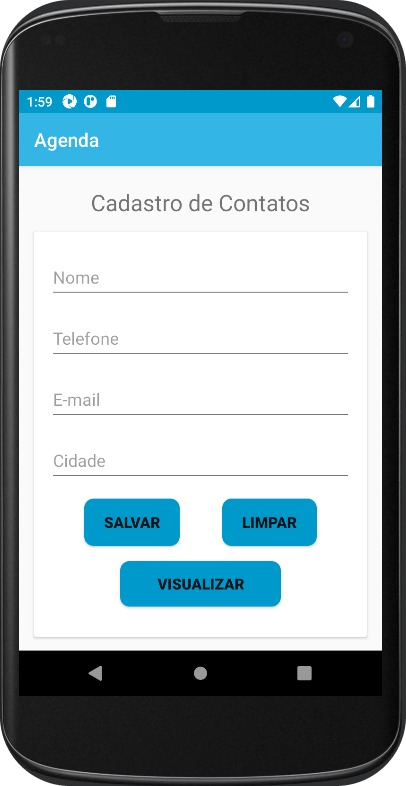
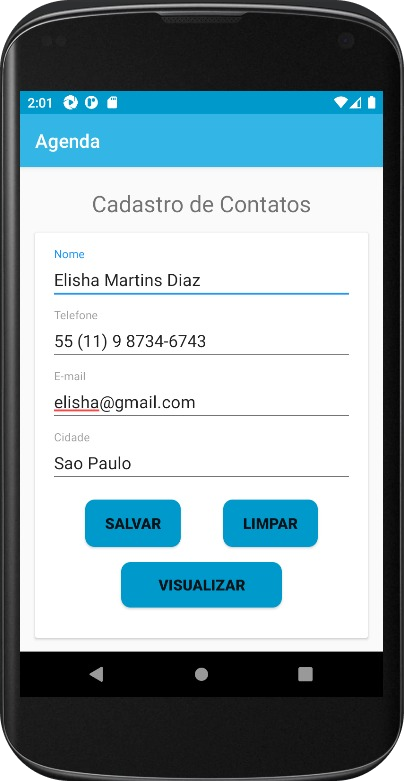

<h1 align="center">
     
    
🚀  Agendar Contatos - APP

</h1>

<h1>
     
    
🎨 Layout

</h1>

     
     

<h1>
     
    
🛠️ Tecnologias Utilizadas

</h1>

 
 
 
  
  
  
 

<h1>
     
    
👋 Saudações, Eli!

</h1>

_Caso queira contribuir com meu projeto, será totalmente bem-vindx!!!_
_Qualquer dúvida ou sugestão, chama no contatinho!_

 

### Vamos nos conectar!

- [LinkedIn](https://www.linkedin.com/in/elisabete-a-santos/)
- [GitHub](https://github.com/elisabetealves)

### Feito com 💕 e muita dedicação

